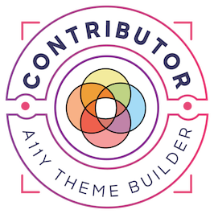
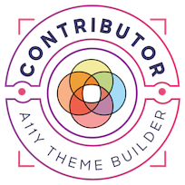

<h1 align="center">Hi , I'm Abhinav Pandey</h1>
<h3 align="center">A Programmer from India</h3>

  

- 🔭 I love **Observational Astronomy**

- 🌱 I’m currently learning **Machine Learning, Cloud Development and DevOps**

- 📝 I regularly write articles on [DevTo](http://dev.to/devrx) and [B1O5 Blogs](https://b1o5.vercel.app/)

- 📫 How to reach me **abhinavpandey1230@gmail.com**

- ⚡ Fun fact **I roll my eyes when I'm mad**

- 👀 Find my resume [here]https://drive.google.com/file/d/12Tc-9wkywnnxZPWp-vJJgH9EORyqLnoW/view?usp=drivesdk)

 

   

### FINOS Contributions

| Community Champion | Technical Contributor |
|--------------------|-----------------------|
|  |  |

 </a> 

### Connect with me

       

### My Stats

&nbsp;

 

 

